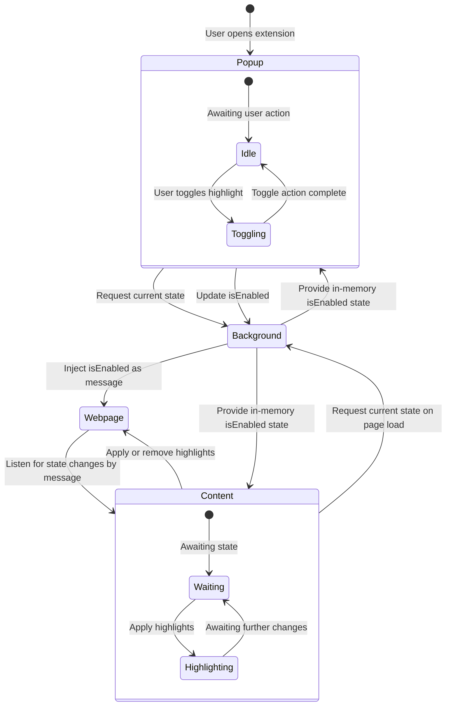

# Heading Highlighter Chrome Extension

## Overview

This is a simple Chrome extension built with **Plasmo** that allows users to toggle background highlighting for all headings (`h1` - `h6`) on a webpage. The extension uses **Plasmo’s messaging service** to communicate between the popup and content scripts, ensuring dynamic updates when toggling the feature.

## Features

- Toggle switch in the popup to enable/disable highlighting.
- Applies a **blue background color** to all headings (`h1`-`h6`).
- Uses **Plasmo content scripts** to modify the DOM dynamically.
- No need for storage; instead, it uses **message passing** for real-time updates and **background script** to store state in-memory.

---

## Installation

### **1. Clone Repo**

In your work directory, run this command to clone the repo and go into the local repo folder:

```sh
git clone https://github.com/maxitect/heading-highlighter.git
cd heading-highlighter
```

### **2. Install Dependencies**

Ensure you have **Node.js** and **pnpm** installed. Then, install Plasmo dependencies:

```sh
pnpm install
```

### **3. Run in Development Mode**

You can run the extension in **development mode** to test it live:

```sh
pnpm dev
```

Then, open Chrome and go to:

```
chrome://extensions/
```

- Enable **Developer Mode** (toggle in the top-right corner).
- Click **Load Unpacked** and select the `chrome-mv3-dev` in your project's `build` folder.

---

## Building & Installing for Production

To create a production-ready version of the extension:

```sh
pnpm build
```

This will generate a `build` folder. To install it in Chrome:

1. Open `chrome://extensions/`
2. Enable **Developer Mode**.
3. Click **Load Unpacked**.
4. Select the `chrome-mv3-prod` in your project's `build` folder.

> [!WARNING]
> FOR LINUX USERS\
> When running `pnpm dev` or `pnpm build` in a Linux environment you may come accross dumping errors or errors related to a package called `sharp`. You may see an error such as:
>
> ```sh
>  ELIFECYCLE  Command failed with exit code 139.
> ```
>
> These seem to be caused by the latest `plasmo` dependencies under its tailwind configuration. Although such an error may pop up, the project has built and you can load it into Chrome as described above.

---

## How It Works

### **State Management Diagram**



### **Code File Explanations**

#### **Toggle Switch (`features/toggle.tsx`)**

- Implements a **Tailwind-styled** toggle switch **React** component.
- Uses `peer` class-based styling for visual state changes.

#### **Popup (`popup.tsx`)**

- Implements a **Tailwind-styled** popup menu **React** component, rendering **toggle switch** interaction and current highlighting state state (ON or OFF).
- Manages the toggle switch state (`isEnabled`).
- Requests the current state from the **background script** using `sendToBackground()`.
- Updates the state when toggled and sends the new value to the **background script**.

#### **Background Script (`background/messages/toggleState.ts`)**

- Stores the `isEnabled` state **in memory** (resets when the extension reloads).
- Responds to state requests from the **popup** and **content script** via `sendToBackground()`.
- Notifies all open tabs of state changes by **injecting `window.postMessage()`** via `chrome.scripting.executeScript()`.

#### **Content Script (`contents/highlightHeadings.ts`)**

- Runs on **all webpages** (`<all_urls>`).
- On **page load**, requests the current `isEnabled` state from the **background script**.
- Listens for **`TOGGLE_HIGHLIGHTS`** messages via `window.postMessage()`.
- Dynamically updates heading background colors based on the received state.

---

## Improvements & Future Enhancements

### **1️⃣ Custom Highlight Colors**

Allow users to select a **custom highlight color** instead of defaulting to blue. This can be achieved by adding an input color picker in the popup and passing the selected color to the content script.

### **2️⃣ Per-Site Preferences**

Instead of applying highlighting to all tabs, store the user’s preference **per website** using `chrome.storage.sync`. This would allow users to keep highlighting on specific sites.

### **3️⃣ Keyboard Shortcut Support**

Add a **keyboard shortcut** (e.g., `Ctrl + Shift + H`) to toggle highlighting without opening the popup. This can be implemented using `chrome.commands`.

### **4️⃣ Improved UI & Feedback**

- Display a **notification or badge** when highlighting is enabled.
- Show a **preview of the highlight effect** inside the popup.

### **5️⃣ State Storage**

Use plasmo storage API to store state in chrome storage and retrieve it persistently even after reloading the extension.

---

## Contributing

Feel free to fork this repository and submit a pull request if you’d like to improve the extension! Suggestions, bug reports, and enhancements are always welcome.

---

## License

This project is licensed under the **MIT License**. You are free to use, modify, and distribute this extension as needed.

---

## Contact

If you have any questions or suggestions, feel free to open an issue or reach out. Happy coding! 🚀
